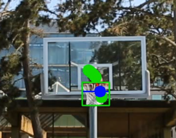

# Basketball Smart Referee

Welcome to the **Basketball Smart Referee** project! This README will guide you through the project's purpose, implementation details, usage, and show the results of our method.

**Team:**
- Donovan Sanders
- Andrew Cen
- Alex Trevithick

---

## Table of Contents

1. [Abstract](#abstract)
2. [Installation](#installation)
3. [Usage](#usage)
4. [Video Results](#video-results)
4. [Other Content](#other-content)
5. [ESP32 Setup](#esp32-setup)
5. [ESP32 and Python](#esp32-using-stream-for-python)
---


## Abstract

In this repo, we present the results and code for our project on creating an automated referee for pickup basketball games. Assuming a single-view camera setup, we present a method to quickly detect made shots and the team of the scorer (assuming black/white uniforms). In order to accomplish this, we leverage a YoLo model finetuned for basketball, human, and rim detection from [RoboFlow](https://universe.roboflow.com/roboflow-universe-projects/basketball-players-fy4c2). Using the 2D tracking of the ball and the rim, we can calculate a 2D linear approximation of the ball trajectory and check if it intersects the correct area of the rim to make a point, along with other heuristics to ensure proper point counting including the cosine similarity of the rim with the ball trajectory along with checks on the ball height. Simultaneously, we leverage the SoTA [FastSAM](https://github.com/CASIA-IVA-Lab/FastSAM) model, for real-time segmentation of the players clothing. Using the detected pixels for both players bounding boxes, we can threshold the pixel intensity or check which player has a darker shirt. Note that our solution does not require training per game, and naturally generalizes due to the large-scale priors leveraged in our work.


---

## Installation

# Setting up a conda environment
Most of the code for our pipeline resides in the ```FastSAM/roboflow/run.ipynb``` Juptyter notebook. We rely on a RoboFlow and FastSAM, and have tested on an NVIDIA RTX 3090 GPU.

In order to set up the correct conda environment, please first download Anaconda, then follow the environment setup instructions in [FastSAM](https://github.com/CASIA-IVA-Lab/FastSAM). Next, please clone FastSAM into the folder FastSAM, retaining the subfolder roboflow.

Activate the environment with

```conda activate FastSAM```

Follow the additional steps to acquire a RoboFlow API key and install the necessary packages to run the RoboFlow models on GPU:

```pip install inference supervision```

Replace the variable api_key inside the python notebook ```FastSAM/roboflow/run.ipynb``` with a string corresponding to your API key. 

# File Layout
It is expected that the file layout closely follows that of FastSAM, considering almost all of the files at the top level are the same as FastSAM. The file structure should look like

.
├── FastSAM
│   └── roboflow
└──    └── run.ipynb


# Setting up the data
We assume a single-view camera of the basketball game with the rim approximately centered in the shot and the camera looking approximately from half-court. After gathering the data into ```movie.mov```, we will consider this as the path to your desired data. Please replace the two mov names in the first cell with this file path. In some cases, the rim may only be detected with a tighter crop on the video. For these cases, you should set the cropped video path to ```movie_cropped.mov``` and replace the corresponding file path in the notebook. To create such a cropped version of the input video, run the following command:

```ffmpeg -i movie.mov -filter:v "crop=scale(in_w*0.5,in_h*0.5)" movie_cropped.mov```

after installing ```ffmpeg``` with ```pip install ffmpeg```.


---

## Usage

With all of the data set up and environment properly configured, we can now get to detecting basketball shots and teams! To do so, simply run the cells of the juypyter notebook run.ipynb. The resuls will be saved as a video ```output.MOV``` inside of the current roboflow directory. Visualized there, you will see the ball detections over the last N frames, the rim detection, the player detection, and a score counter for each time. 

---

## Video Results

We provide some other visualizations and results of our method here. For example, here is a visualization of the detected pixels for each team colored with the color of their team:


Here is an image visualizing the line of best fit for a ball's current trajectory and the point of intersection with the line for the basketball rim:



## ESP32: Setup 


To use the software in real-time, we used the ESP32-S3 Wroom 1 by Freenove. There multiple different ESP32 modules available, so please closely follow the tutorials that came with your ESP32 to correctly install the necessary drivers to connect it with your Arduino IDE. 

The tutorials also contain other important information that will be important for setting up your ESP32, such as the camera model, board type, and PSRAM configuration (if available). It also provides links for the necessary ESP32 boards and libraries for the Arduino IDE that must be downloaded before it can be used. 

All the code for the ESP32 can be found in the ```CameraWebServer_esp32s3/CameraWebServer_esp32s3.ino``` folder. Open the sketch in the Arduino IDE to easily upload the sketch to your ESP32. You may need to connect certain GPIO pins to the ESP32 ground to download the code to your model, please refer to the tutorials given for your ESP32 for more information if needed. Please read the ESP32:Streaming section for more setup information.

## ESP32: Streaming 

The ESP32 should have versions of the Wifi Station Mode and Camera Web Server examples for your model. Try running both of the examples to ensure your ESP32 is working properly.

Wifi Station Mode to determine if your ESP32 is able to connect to your Wifi network. Camera Web Server to ensure your camera is properly working.

## ESP32: Using Stream for Python 

Once you have confirmed you can stream with your ESP32, we can finally move to using the software with the ESP32! First, upload the ```CameraWebServer_esp32s3.ino``` to your ESP32 and confirm the stream is running by navigating to the IP address given by the serial monitor. Assuing you are able to connect to the network, we can then use the ```roboflow_esp32_stream.ipynb``` notebook to use with a live pickup game! Simply open the file and run the cells within, similar to the above sections changing the API key as needed. 


## Other Content

We also provide the additional content for our project including our created slides, our video, and the reports. For example, ```slides.pdf``` contains the slides for our project. We will also add our final report when it is finished.


## Thanks
Thanks to the amazing FastSAM repo, on which we based our project, and additional thanks to the awesome RoboFlow API. 
